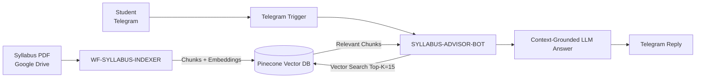

# Syllabus Indexer & Advisor Bot — n8n RAG Assignment

## 1. Overview
This project implements a **two-workflow Retrieval-Augmented Generation (RAG)** system in n8n:

- **WF-SYLLABUS-INDEXER (Ingestion)**  
  PDF → Text → Chunks → Embeddings → Pinecone

- **SYLLABUS-ADVISOR-BOT (Retrieval + Answering)**  
  Telegram Query → Vector Search (Top-K=15) → LLM Answer → Telegram Reply

The key design goal is **production-style separation of concerns**:
- Indexing is **offline, controlled, and repeatable**
- Answering is **real-time and isolated from indexing noise**

This mirrors how real enterprise RAG systems are structured.

---

## 2. High-Level Architecture



---

## 3. Architecture (Nodes & Wiring)

### Workflow A — WF-SYLLABUS-INDEXER
Purpose: Convert the syllabus PDF into a Pinecone vector knowledge base.

**Nodes**
- **Manual Trigger** → runs indexing on demand.
- **Google Drive: Download File** → loads syllabus PDF.
- **File Structuring (Code)** → normalizes binary for consistent extraction.
- **Move Binary → Text** → converts PDF into plain text.
- **Chunking + Metadata (Code)** → slices text into semantic blocks + overlap.
- **OpenAI Embeddings** → vectorizes each chunk.
- **Pinecone: Upsert** → stores vectors + metadata.

**Wiring**
Manual Trigger → Download → Structuring → Binary→Text → Chunking → Embeddings → Pinecone Upsert

---

### Workflow B — SYLLABUS-ADVISOR-BOT
Purpose: Answer student queries using grounded retrieval.

**Nodes**
- **Telegram Trigger** → receives student queries.
- **Extract Query (Code)** → isolates `query` + `chatId`.
- **AI Agent Node** → orchestrates retrieval + reasoning.
- **Pinecone Vector Search** → Top-K=15 retrieval.
- **OpenAI Chat Model** → grounded answer.
- **Telegram: Send Message** → deliver result.

**Wiring**
Telegram → Extract Query → AI Agent → Pinecone Search → LLM Answer → Telegram Reply

## 4. Design Decisions (Why These Choices?)

### 4.1 Chunking / Embeddings / Search — Decision Table

| Layer | Choice Used | Why This Choice | Trade-offs |
|---|---|---|---|
| **Chunking style** | **Fixed-length chunking + overlap** | Syllabus text is structured and repetitive. Fixed chunks are robust inside n8n (no dependency on heavy NLP splitters). Overlap prevents “concept amputation” across boundaries. | Not as precise as pure semantic chunking, but far safer for automation reliability. |
| **Chunk size** | **~300–500 characters** | Sweet spot for syllabus: each chunk usually contains 1–2 concepts (topic + subtopic). Small enough for precise retrieval; large enough to preserve context. | Too small → noisy retrieval. Too big → diluted context. |
| **Overlap** | **~20–30% (50–100 chars)** | Prevents losing definitions or list items that straddle chunk boundaries. Critical for “list topics” and “module-wide” queries. | Slightly more storage and redundancy. Worth it for accuracy. |
| **Embedding model** | **OpenAI text-embedding-3-large** *(or 3-small for cheaper v1)* | Strong semantic recall on educational/structured text. Stable across paraphrases (“module topics” vs “chapter list”). | 3-large costs more; 3-small slightly weaker recall. |
| **Vector DB** | **Pinecone** | Managed, fast, reliable similarity search. Clean API from n8n. Ideal for small/medium corpora like one syllabus. | External dependency + cost at scale. |
| **Similarity metric** | **Cosine similarity** *(Pinecone default)* | Best match for normalized OpenAI embeddings. | None for this use case. |
| **Retrieval Top-K** | **K = 15** | Needed because syllabus questions are often global (“list all topics”, “modules in syllabus”). Higher K ensures coverage of distributed lists. | Higher K increases LLM context size and token cost. |
| **Search type** | **Pure semantic vector search** | Handles paraphrases and fuzzy student language. Works better than keyword-only search for this domain. | No exact keyword fallback yet. Hybrid can be added later. |
| **Reranking** | **None (v1)** | Simplicity: Pinecone Top-K already sufficient for syllabus scale. | Sometimes retrieves loosely related chunks; reranker would improve precision. |

---

### 4.2 Why Not “Semantic Chunking” in v1?
Semantic chunking requires:
- sentence boundary detection
- topic boundary heuristics
- extra libraries or heavy code

In n8n you want **deterministic and low-fragility splitting first**.  
Once stable, semantic chunking or recursive splitters become a safe v2 upgrade.

---

### 4.3 Why K = 15 (Explicit Justification)
Two query classes exist:

1. **Local questions**  
   Example: “practice hours for Trigonometry?”  
   → Only needs 1–3 chunks.

2. **Global syllabus questions**  
   Example: “List all topics in Module 1”, “What are all modules?”  
   → Relevant chunks are **spread across the PDF**.

K=15 ensures global coverage without forcing multiple retrieval cycles.  
Earlier failures at K=5 happened because distributed lists were under-retrieved.

## 5. WF-SYLLABUS-INDEXER (Deep Dive)

**Purpose:** Build a clean vector knowledge base from PDF.

**Pipeline**
1. **Download syllabus PDF** from Google Drive  
2. **Extract plaintext**  
3. **Chunk with overlap + metadata**  
4. **Embed each chunk** using OpenAI  
5. **Upsert to Pinecone**

### Metadata Stored
Metadata gives traceability and allows future filtering.

Example:
```json
{
  "filename": "syllabus.pdf",
  "subject": "Mathematics",
  "board": "CBSE",
  "year": "2025",
  "chunk_index": 12,
  "chunk_count": 58
}
```

---

## 6. SYLLABUS-ADVISOR-BOT (Deep Dive)

**Purpose:** Answer student questions using grounded RAG.

**Pipeline**
1. Telegram receives a student query  
2. Agent sends query to Pinecone  
3. Pinecone returns Top-K=15 chunks  
4. LLM answers ONLY from retrieved text  
5. Telegram sends response back to student

This guarantees answers are syllabus-bounded.

---

## 7. AI System Prompt (Grounding Rules)

Core rules used in the AI Agent:

- Always retrieve before answering  
- Never hallucinate  
- Say “not in syllabus” only if retrieval yields zero useful chunks  
- For list/global queries, synthesize across all retrieved chunks  
- Interpret “modules/chapters” as syllabus topic groups

Production-style prompt:

```
You are Syllabus_advisor_bot.

Answer ONLY from the retrieved syllabus sections from Pinecone.
You must ALWAYS call the Syllabus Search tool before answering.

Rules:
- When user says “module” or “chapter”, interpret as Topic/NCERT chapter.
- Ignore filler words (“ok”, “yes go ahead”).
- For LOCAL questions, give direct specific answers.
- For LIST questions, return ALL discovered topics.
- Use: “Based on the syllabus sections I can see…” when uncertain.
- Say “This information is not available in the syllabus.” only when Pinecone returns zero matches.
- Absolutely no hallucinations.
```

## 8. Real Telegram Q&A (Expected Results)

### Global question  
**User:** “List all topics”  
**Bot:** Lists all syllabus topics using synthesis across Top-K context.

### Priority filter  
**User:** “Which topics are high priority?”  
**Bot:** Returns exactly the high-priority marked topics.

### Local question  
**User:** “How many practice hours for Trigonometry?”  
**Bot:** Returns the correct hour estimate from chunk metadata.

### Chapter summary  
**User:** “Summarize Chapter 3”  
**Bot:** Returns a grounded summary from syllabus chunks.

---

## 9. How to Run the Whole System

### A) Create Pinecone Index
- Dimension = embedding dimension of your model  
  (OpenAI models: check dimension in node settings)

### B) Import WF-SYLLABUS-INDEXER
Set credentials:
- Google Drive  
- OpenAI  
- Pinecone  

Run once → vectors are stored.

### C) Import SYLLABUS-ADVISOR-BOT
Set credentials:
- Telegram  
- OpenAI  
- Pinecone  

Activate workflow.

### D) Test in Telegram
Start chatting. RAG is live.

---

## 10. Limitations (v1)
- Only one syllabus file  
- No hybrid keyword + semantic search  
- No reranking layer  
- No source citations in final answers  
- No multi-board routing

---

## 11. Future Extensions (v2+)
- Add hybrid semantic + keyword search  
- Add metadata filters (class, year, board)  
- Add multiple syllabi  
- Add “Explain Like I’m 12” modes  
- Add confidence-based fallbacks  
- Add citations (chunk IDs) in answers

