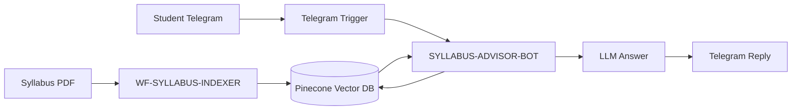

# Syllabus Indexer & Advisor Bot — n8n RAG Assignment

## 1. Overview
This project implements a **two-workflow Retrieval-Augmented Generation (RAG)** system in n8n:
- **WF-SYLLABUS-INDEXER** for PDF ingestion
- **SYLLABUS-ADVISOR-BOT** for Telegram-based question answering

## 2. High-Level Architecture

## 3. Architecture (Nodes & Wiring)
### Workflow A — WF-SYLLABUS-INDEXER
- Manual Trigger → Download PDF → File Normalize → PDF→Text → Chunking → Embeddings → Pinecone Upsert

### Workflow B — SYLLABUS-ADVISOR-BOT
- Telegram Trigger → Extract Query → AI Agent → Pinecone Search → LLM → Telegram Reply

## 4. Design Decisions Table
| Layer | Choice | Why | Trade-offs |
|-------|--------|-----|------------|
| Chunking | Fixed + Overlap | Works cleanly in n8n; safe boundaries | Less semantic precision |
| Chunk Size | 300–500 chars | Ideal context size | Too small = noisy |
| Overlap | 20–30% | Prevents lost context | More storage |
| Embeddings | text-embedding-3-large | Strong semantic recall | Higher cost |
| Vector DB | Pinecone | Fast, managed | External dependency |
| Top-K | 15 | Needed for global syllabus queries | Higher LLM cost |
| Search | Semantic | Handles paraphrases | No keyword fallback |

## 5. Indexer Deep Dive
1. Download syllabus  
2. Convert to text  
3. Chunk with metadata  
4. Embed using OpenAI  
5. Upsert to Pinecone  

## 6. Advisor Bot Deep Dive
1. Telegram receives query  
2. Pinecone Top-K search  
3. LLM synthesizes grounded answer  
4. Reply via Telegram  

## 7. Prompting Rules
- Always retrieve before answering  
- No hallucinations  
- Use synthesis for global queries  
- Declare “not in syllabus” only when zero relevant chunks  

## 8. Running Steps
1. Configure Pinecone  
2. Import indexer workflow and run once  
3. Import advisor workflow and activate  
4. Chat via Telegram  

## 9. Limitations
- Single syllabus  
- No hybrid search  
- No reranking  
- No citations  

## 10. Future Extensions
- Hybrid search  
- Reranking  
- Multi-syllabus routing  
- Confidence scoring  
- Citation mode  
