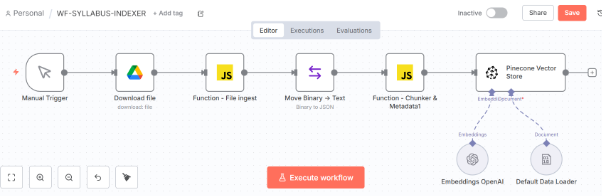
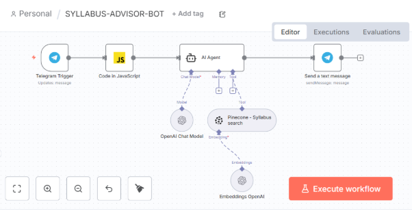

\# Syllabus Indexer & Advisor Bot (n8n RAG Assignment)

\> End-to-end Retrieval-Augmented Generation (RAG) pipeline built in \*\*n8n\*\* with \*\*Pinecone\*\*, \*\*OpenAI\*\*, and a \*\*Telegram\*\* frontend.

This repository contains two coordinated n8n workflows:

1\. \*\*WF-SYLLABUS-INDEXER\*\* – Ingests a syllabus file, chunks it, embeds it using OpenAI, and stores vectors + metadata in Pinecone.

2\. \*\*SYLLABUS-ADVISOR-BOT\*\* – A Telegram chatbot that answers student queries using RAG search over the indexed syllabus.

Although this is an “assignment”, the design mirrors how real production RAG systems are structured.

\---

\## 📚 Table of Contents

\- [High-Level Architecture](#high-level-architecture)

\- [Workflow 1 – WF-SYLLABUS-INDEXER](#workflow-1--wf-syllabus-indexer)

`  `- [Workflow Diagram](#workflow-diagram)

`  `- [Node-by-Node Explanation](#node-by-node-explanation)

`  `- [Chunking & Metadata Logic](#chunking--metadata-logic)

\- [Workflow 2 – SYLLABUS-ADVISOR-BOT](#workflow-2--syllabus-advisor-bot)

`  `- [Workflow Diagram](#workflow-diagram-1)

`  `- [AI Agent Prompt Design](#ai-agent-prompt-design)

`  `- [RAG Search Configuration](#rag-search-configuration)

\- [RAG Design Choices](#rag-design-choices)

\- [Example Q&A (Real Telegram Runs)](#example-qa-real-telegram-runs)

\- [How to Run This Project](#how-to-run-this-project)

\- [Limitations & Possible Improvements](#limitations--possible-improvements)

\- [Loom Video Script](#loom-video-script)

\- [Credits](#credits)

\---

\## 🔭 High-Level Architecture

At a high level, the system follows the standard RAG pipeline:

\```mermaid

flowchart LR

`    `A[Syllabus PDF in Google Drive] --> B[WF-SYLLABUS-INDEXER]

`    `B -->|Text + Chunks + Embeddings| C[(Pinecone Vector Store)]

`    `D[Student on Telegram] --> E[Telegram Bot / n8n Trigger]

`    `E --> F[SYLLABUS-ADVISOR-BOT]

`    `F -->|Semantic Query| C

`    `C -->|Relevant Chunks| F

`    `F --> G[Answer with Citations]

`    `G --> H[Reply on Telegram]

Ingestion is separated from question-answering, which is how production RAG systems are typically structured.

Pinecone acts as the single source of truth for syllabus vectors.

The AI Agent in n8n handles retrieval orchestration + answer generation.

Workflow 1 – WF-SYLLABUS-INDEXER

Purpose

Prepare the syllabus for RAG:

Download the syllabus file.

Convert it to text.

Chunk + enrich with metadata.

Generate embeddings.

Store in Pinecone.

Workflow Diagram



Node-by-Node Explanation

Manual Trigger

Why: Indexing is done only when a new/updated syllabus is ready.

Keeps ingestion under explicit human control.

Download File (Google Drive)

Input: File ID of the syllabus (PDF / doc).

Why: Centralised source of truth. This can later be replaced by API, Dropbox, or local storage without changing downstream logic.

Function – File Ingest (JavaScript)

Reads the downloaded binary and prepares the structure expected by n8n’s binary → text node.

Typical responsibilities:

Ensuring correct binary property name.

Attaching basic metadata (filename, mimetype).

Move Binary → Text (Binary to JSON)

Converts PDF binary into plain text.

Why: LLMs and embeddings need text, not raw files.

This step shields later logic from file format complexity.

Function – Chunker & Metadata (JavaScript)

Core ingestion logic:

Splits the syllabus text into smaller overlapping chunks.

Attaches metadata per chunk.

See Chunking & Metadata Logic for details.

Embeddings – OpenAI

Model: text-embedding-3-large (or equivalent configured model).

Why this model:

High quality for semantic similarity.

Optimised cost/performance for academic/structured text.

Pinecone Vector Store

Writes:

embedding vector

chunk text

metadata fields

Why Pinecone:

Production-ready vector DB.

Natively integrated as an n8n node.

Allows filtering and scaling beyond the assignment.

Chunking & Metadata Logic

Chunking strategy:

Chunk size: ~300–500 characters

Overlap: ~20–30% (to avoid cutting sentence/row boundaries harshly)

Why this design:

Small enough for precise retrieval and to fit comfortably inside LLM context windows.

Overlap ensures that important lines (e.g., topic + hours + priority) are not split across chunks and lost.

Metadata stored per chunk (example):

json

Copy code

{

`  `"filename": "CBSE\_Math\_Class10\_2025.pdf",

`  `"subject": "Mathematics",

`  `"board": "CBSE",

`  `"year": "2025",

`  `"sha256": "<file\_hash>",

`  `"chunk\_index": 12,

`  `"chunk\_count": 57

}

sha256 ensures idempotent ingestion (no duplicate index for same file).

subject, board, year prepare the pipeline for multi-syllabus / multi-board use in future.

chunk\_index and chunk\_count make debugging and re-construction easy.

Workflow 2 – SYLLABUS-ADVISOR-BOT

Purpose

Expose the RAG index through a friendly Telegram chatbot that answers syllabus questions.

Workflow Diagram



Node-by-Node Explanation

Telegram Trigger

Listens for incoming messages from a configured Telegram bot.

Every message starts a new execution of this workflow.

Provides structured JSON including:

message.text

from.id

chat metadata.

Code in JavaScript

Normalises input into a clean query string:

js

Copy code

return [{

`  `query: $json.message.text,

`  `chatId: $json.chat.id

}];

Why: Keeps the AI Agent node free from Telegram-specific schema details.

Additional logic (if needed) could include:

trimming,

lower-casing,

stripping bot commands.

AI Agent (n8n Agent Node)

Central orchestration unit.

Wired to:

Chat Model: OpenAI Chat model (e.g., gpt-4.1-mini / gpt-4.1).

Tool: Pinecone – Syllabus Search.

Responsibilities:

Formulate tool calls (search queries) from user questions.

Read retrieved chunks.

Compose final natural-language answers.

OpenAI Chat Model

The reasoning engine used by the AI Agent.

Handles:

understanding natural language questions,

following the system prompt,

structuring responses.

Pinecone – Syllabus Search

Configured as a Tool for AI Agent with:

Operation: Retrieve Documents (as Tool for AI Agent)

Index: The one populated by WF-SYLLABUS-INDEXER.

Top K: 15

👈 This was explicitly increased from the default (3–5) to handle global questions like “List all topics in the syllabus”.

Search type: Semantic vector search.

Returns a list of most relevant chunks with metadata.

Send a Text Message (Telegram)

Uses:

text

Copy code

Chat ID: {{ $('Telegram Trigger').item.json.message.chat.id }}

Text:    {{ $json.output }}

Sends the assistant’s answer back to the same Telegram conversation.

AI Agent Prompt Design

The system message (simplified for README) is:

text

Copy code

You are Syllabus\_advisor\_bot.

The syllabus is stored in Pinecone as text chunks. It is mostly a table with columns like Topic, NCERT chapter, Priority, and Practice\_Hrs.

You must ALWAYS:

1\. Call the Pinecone Syllabus Search tool to retrieve relevant chunks.

2\. Read ALL retrieved chunks carefully.

3\. Answer using ONLY information from those chunks.

Interpretation rules:

\- Treat “module” or “chapter” as referring to the Topic / NCERT chapter in the table.

\- Ignore filler confirmations like “yes go ahead” / “ok” when determining the question.

LOCAL questions (e.g., “practice hours for Trigonometry?”):

\- Give a direct answer with short context (topic, chapter, priority, hours).

LIST questions (“list all topics”, “all HIGH priority topics”):

\- Build the MOST COMPLETE list from all retrieved chunks.

\- On the first attempt, do NOT refuse.

\- If you are unsure the list is complete, start with:

`  `“Based on the syllabus sections I can see, …”

Refusals:

\- Only say “This information is not available in the syllabus.” when there is absolutely no related information in ANY retrieved chunk.

\- Never invent topics or hours that don’t appear in the chunks.

Why this matters:

The first version of the bot was too strict and refused to answer global questions.

This prompt explicitly distinguishes local vs global questions and encourages partial-but-honest answers instead of useless refusals.

RAG Search Configuration

Key parameters for RAG in the Advisor Bot:

Parameter	Value	Reason

Vector DB	Pinecone	Fast, production-grade, n8n integration

Embedding Model	text-embedding-3-large	Good semantic quality for syllabus content

Search Type	Semantic (dense vector)	Students phrase questions differently; semantic search handles this well

Top K	15	Ensures enough coverage for global list queries (e.g., “list all topics”)

Filter	(none, in this assignment)	Single syllabus only; future-ready for board/subject filters

Answer Source	Strictly retrieved chunks	Prevents off-syllabus hallucinations

🧠 RAG Design Choices

Separated ingestion & serving workflows

Mirrors real RAG deployments where indexing and querying are decoupled.

Chunking instead of whole-file search

Directly querying whole PDF text would be inefficient and noisy.

Chunking improves both relevance and performance.

High Top-K for coverage

Legal/enterprise setups often use a hybrid strategy: high recall on retrieval, then re-ranking.

Here, increasing Top K to 15 was enough to fix global questions without adding complex re-ranking.

Conservative but not paralysed prompting

Bot is forbidden from hallucinating.

But it is allowed to answer partially for global questions, with an explicit caveat.

📌 Example Q&A (Real Telegram Runs)

These are actual responses observed through the Telegram bot.

1\. Global Topic Listing

User (Prashanth):

List all topics in the syllabus

Syllabus\_advisor\_bot:

Based on the syllabus sections I can see, here are the topics listed:

Real Numbers

Polynomials

Pair of Linear Equations in Two Variables

Quadratic Equations

Arithmetic Progressions

Triangles

Coordinate Geometry

Introduction to Trigonometry

Some Applications of Trigonometry

Circles

Constructions

Areas Related to Circles

Surface Areas and Volumes

Statistics

Probability

If you want, I can also tell you which topics are HIGH priority or how many hours are allocated in total.

2\. Mixed Local + List Question

User:

What topics are marked HIGH priority?

Bot:

Based on the syllabus sections I can see, the topics marked as HIGH priority are:

Sets & Functions (NCERT Chapter 1) with 10 practice hours

Trigonometry (NCERT Chapter 3) with 8 practice hours

Permutation & Combination (NCERT Chapter 7) with 9 practice hours

Sequences & Series (NCERT Chapter 9) with 8 practice hours

Limits & Derivatives (NCERT Chapter 12) with 10 practice hours

Probability (NCERT Chapter 16) with 8 practice hours

If you want, I can also tell you the practice hours allocated for each HIGH priority topic.

3\. Strict Local Question

User:

How many practice hours are marked to Trigonometry?

Bot:

The syllabus marks 8 practice hours for the topic of Trigonometry. This information is found in the practice hours allocation section.

4\. When Data is Missing

If a user asks something genuinely outside the syllabus, e.g.:

Does this course include Machine Learning?

The bot correctly replies:

This information is not available in the syllabus.

This demonstrates non-hallucinating behaviour.

🚀 How to Run This Project

Prerequisites

n8n account (cloud or self-hosted)

Pinecone account + API key

OpenAI API key

Telegram Bot (via BotFather)

Environment Variables (example)

In n8n settings or environment:

PINECONE\_API\_KEY

PINECONE\_ENVIRONMENT

PINECONE\_INDEX\_NAME

OPENAI\_API\_KEY

TELEGRAM\_BOT\_TOKEN

Steps

Create Pinecone index

Dimension must match the embedding model (e.g., 1536).

Example name: icn8n-syllabus-index.

Import WF-SYLLABUS-INDEXER JSON into n8n

Configure:

Google Drive credentials.

Pinecone credentials.

OpenAI credentials.

Run once to index your syllabus file.

Import SYLLABUS-ADVISOR-BOT JSON into n8n

Configure:

Telegram credentials.

Connect AI Agent to:

Chat Model node

Pinecone – Syllabus search node.

Activate workflow.

Test from Telegram

Message your bot:

“List all topics in the syllabus”

“What topics are marked HIGH priority?”

“How many hours for Trigonometry?”

⚠️ Limitations & Possible Improvements

Current limitations

Single syllabus / single board.

Pure semantic search (no keyword/hybrid re-ranking).

No per-user conversation memory beyond the current workflow run.

Answers are English-only, matching the current syllabus language.

Potential improvements

Add metadata filters for board, class, year, subject.

Use hybrid search (keyword + semantic) for more robust retrieval.

Add answer citations (e.g., “Source: Row 12, Practice Hours table”).

Extend to multi-document RAG: textbooks, assignments, question banks.
